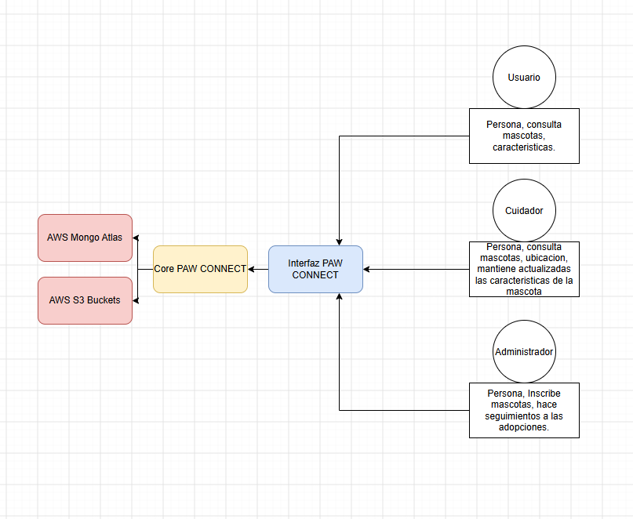
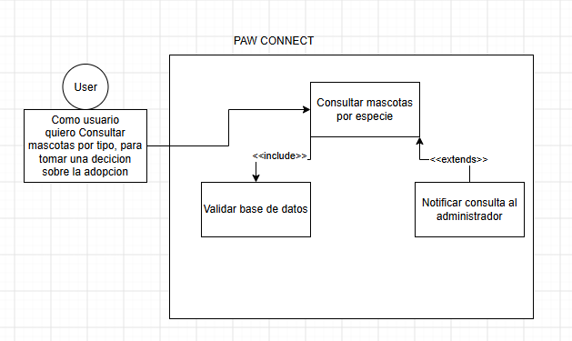
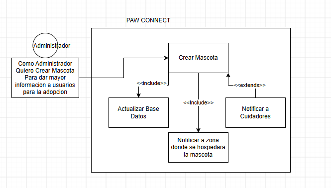
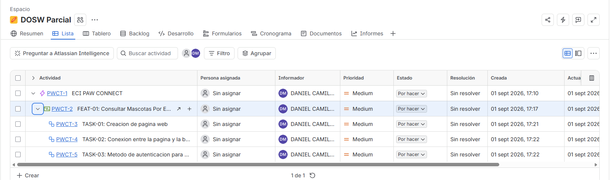

# Parcial Práctico - Primer Tercio (DOSW)

* **Estudiante:** Daniel Camilo Mosquera Martinez
* **Grupo:** 1
* **Enunciado Asignado (Parte 3):** Enunciado **# 1**

---

## Evidencias de Herramientas y Entorno

### 1. Herramienta de Modelado (Draw.io / Lucidchart / Miro)

### 2. Herramienta de Diseño UI (Figma)

### 3. Ejecución Exitosa de Maven

Link Bitacora: https://github.com/Danielmmartinez/DOSW_BITACORA

## Diagrama de Contexto 

## Identificar Requerimientos
### Funcionales
 * Consultar mascotas por especie
 * Consultar compatibilidad de mascotas
 * Crear Mascota
### No funcionales
 * Busqueda rapida en el catalogo
 * Colores Institucionales

## Diagrama de Casos de Uso

## Jira

## Identifique los 2 patrones asignados (Iterator y Composite), especificando para cada uno:
### Iterator
* Nombre del patrón y tipo (creacional, estructural o de comportamiento)
  * Iterator y es de tipo Comportamiento
* Justificación de la decisión en el contexto de ECI Paw Connect
  * Este se usara porque tiene bastantes subgrupos, que en la practica es un duplicado de codigo,
  ademas de encapsular los datos y recorrer toda la matriz de datos
* Diagrama de clases UML de la solución con los dos patrones aplicados

* Cuáles principios SOLID está aplicando y porque 

### Composite
* Nombre del patrón y tipo (creacional, estructural o de comportamiento)
    * Composite y es de tipo Estructural
* Justificación de la decisión en el contexto de ECI Paw Connect
    * Este es **MUY** util en este caso, por que se pueden empaquetar las mascotas por demasiadas variantes distinas, 
  Por especie, por lugar, por caracteristicas. Entonces se le puede sacar mucho provecho a este patron.
* Diagrama de clases UML de la solución con los dos patrones aplicados

* Cuáles principios SOLID está aplicando y porque 

