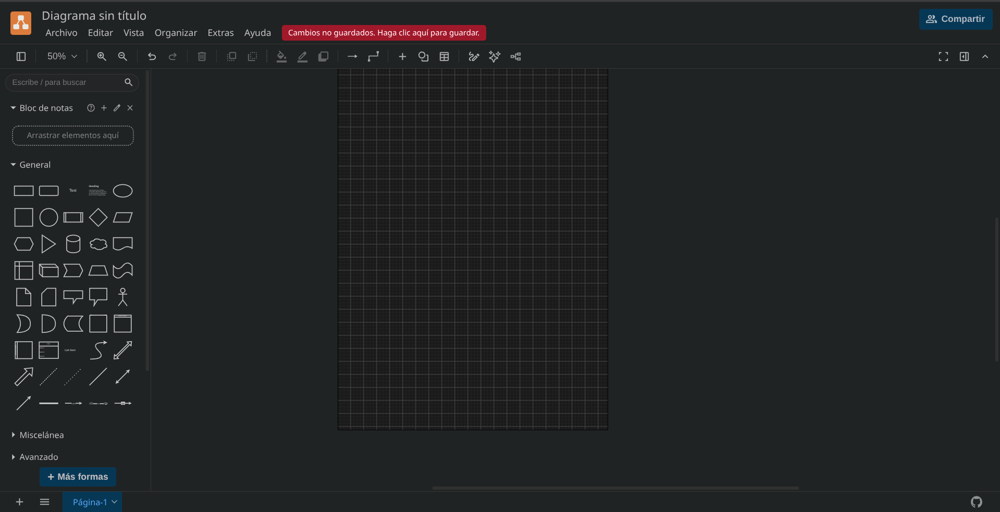
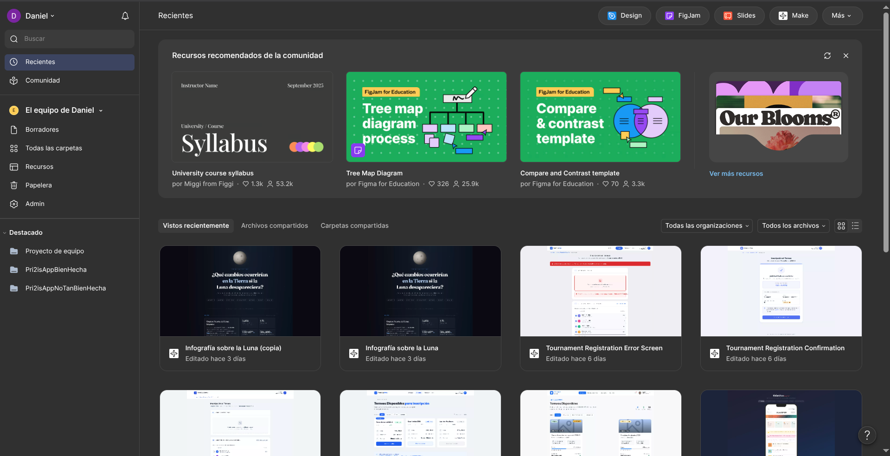
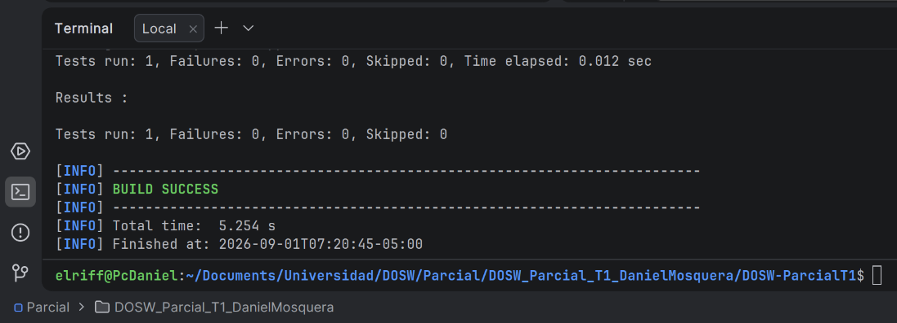

# Parcial Práctico - Primer Tercio (DOSW)

* **Estudiante:** Daniel Camilo Mosquera Martinez
* **Grupo:** 
* **Enunciado Asignado (Parte 3):** *[Espacio reservado]*

---

## Evidencias de Herramientas y Entorno

### 1. Herramienta de Modelado (Draw.io / Lucidchart / Miro)

### 2. Herramienta de Diseño UI (Figma)

### 3. Ejecución Exitosa de Maven

Link Bitacora: https://github.com/Danielmmartinez/DOSW_BITACORA
